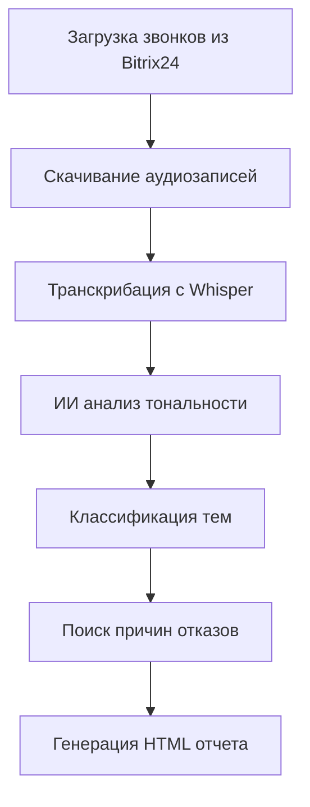

# 🤖 Bitrix24 Local AI Analytics

**Полностью локальная система анализа звонков с ИИ** - никаких внешних API!

## ✨ Особенности

- 🎤 **Локальная транскрибация** с OpenAI Whisper
- 🧠 **Локальный ИИ анализ** с трансформерами  
- 🔒 **Полная конфиденциальность** - данные не покидают ваш сервер
- 💰 **Без внешних API** - нет расходов на OpenAI/Google
- 🚀 **Высокая скорость** обработки на GPU
- 💾 **Умное кеширование** всех этапов

## 🤖 Используемые модели

| Компонент | Модель | Назначение |
|-----------|--------|------------|
| 🎤 Транскрибация | **Whisper (medium)** | Преобразование аудио в текст |
| 😊 Анализ тональности | **RuBERT-based** | Определение настроения клиента |
| 🏷️ Классификация тем | **BART + Zero-shot** | Определение темы разговора |
| ❌ Поиск отказов | **Эвристические алгоритмы** | Выявление причин отказов |

## 📋 Системные требования

### Минимальные требования
- **CPU**: 4+ ядер
- **RAM**: 8GB+ 
- **Диск**: 5GB свободного места
- **Python**: 3.8+

### Рекомендуемые требования  
- **GPU**: NVIDIA с поддержкой CUDA (RTX 3060+)
- **RAM**: 16GB+
- **Диск**: 10GB+ (SSD предпочтительно)

## 🚀 Установка

### 1. Клонирование и настройка окружения

```bash
# Создаем виртуальное окружение
python -m venv venv

# Активируем (Linux/Mac)
source venv/bin/activate
# Или для Windows
venv\Scripts\activate
```

### 2. Установка зависимостей

```bash
# Основные зависимости
pip install -r requirements.txt

# Для GPU ускорения (CUDA 11.8)
pip install torch torchvision torchaudio --index-url https://download.pytorch.org/whl/cu118

# Или для CUDA 12.1
pip install torch torchvision torchaudio --index-url https://download.pytorch.org/whl/cu121

# Или CPU версия (медленнее)
pip install torch torchvision torchaudio --index-url https://download.pytorch.org/whl/cpu
```

### 3. Дополнительные системные пакеты

**Ubuntu/Debian:**
```bash
sudo apt-get update
sudo apt-get install ffmpeg portaudio19-dev
```

**macOS:**
```bash
brew install ffmpeg portaudio
```

**Windows:**
- Скачайте FFmpeg с [официального сайта](https://ffmpeg.org/download.html)
- Добавьте в PATH

## ⚙️ Настройка

### Переменные окружения

Создайте файл `.env`:

```env
# Обязательные настройки Bitrix24
BITRIX_WEBHOOK_URL=https://your-domain.bitrix24.ru/rest/1/your-webhook-code
BITRIX_USERNAME=your-username
BITRIX_PASSWORD=your-password

# Локальные модели загружаются автоматически
# Дополнительных API ключей НЕ требуется!
```

### Получение Webhook Bitrix24

1. **Войдите в Bitrix24** → **Приложения** → **Разработчикам**
2. **Другое** → **Входящий вебхук**
3. **Создайте webhook** с правами:
   - ✅ `voximplant` - для получения звонков
   - ✅ `crm` - для активностей и файлов  
   - ✅ `user` - для имен сотрудников
4. **Скопируйте URL webhook**

## 🎯 Запуск

```bash
streamlit run bitrix_analytics.py
```

**Откроется веб-интерфейс:** `http://localhost:8501`

### Первый запуск

При первом запуске система автоматически:
1. 📥 Скачает модели ИИ (~2-3GB)
2. 🤖 Загрузит их в память
3. ✅ Будет готова к работе

*Это займет 5-10 минут в зависимости от интернета*

## 🔧 Использование

### Веб-интерфейс

1. **Настройте подключение** к Bitrix24 в боковой панели
2. **Выберите период** анализа (день или диапазон)  
3. **Запустите обработку** кнопкой "Загрузить и проанализировать"
4. **Создайте отчет** с детальной аналитикой

### Что происходит при обработке



## 📊 Возможности анализа

### Автоматическое определение:

- **🎯 Темы звонков:**
  - Продажи и коммерческие предложения
  - Техническая поддержка  
  - Консультации по продукту
  - Жалобы и претензии
  - Информационные запросы
  - Заказы и оформление услуг
  - Партнерство и сотрудничество

- **😊 Тональность разговора:**
  - Позитивная (клиент доволен)
  - Негативная (клиент недоволен)
  - Нейтральная (стандартный разговор)

- **❌ Причины отказов:**
  - Высокая цена
  - Не подходит по времени  
  - Уже есть поставщик
  - Не нужна услуга
  - Нужно время подумать
  - Нет бюджета
  - Не устраивают условия

## 📈 Структура отчетов

### HTML отчет включает:

- 📊 **Общую статистику** (всего/входящие/исходящие звонки)
- 👥 **Эффективность менеджеров** с метриками
- 🎯 **Анализ тем звонков** с процентным распределением  
- 😊 **Тональность разговоров** с визуализацией
- ❌ **Топ причин отказов** клиентов
- 📋 **Детальную таблицу** всех звонков с анализом
- 📝 **Примеры транскрипций** с разметкой

### Интерактивные элементы:

- 📊 Графики и диаграммы
- 🔍 Фильтрация и поиск
- 📱 Адаптивный дизайн  
- 💾 Экспорт данных

## 📂 Организация данных

```
bitrix_analytics/
├── audio/                    # Аудиозаписи по датам
│   ├── 2024-01-15/
│   │   ├── 2024-01-15_09-30-15_incoming_Ivan_Petrov_79001234567_id123.mp3
│   │   └── ...
│   └── 2024-01-16/
├── transcripts/              # Транскрибации Whisper
│   ├── 2024-01-15/
│   │   ├── transcript_123.txt
│   │   └── ...
├── analysis/                 # ИИ анализ звонков
│   ├── 2024-01-15/
│   │   ├── analysis_123.json
│   │   └── ...
├── cache/                   # Кеш API данных
│   ├── calls_2024-01-15.json
│   └── ...
└── reports/                # Готовые отчеты
    ├── local_ai_report_20240115.html
    └── ...
```

## ⚡ Оптимизация производительности

### Для ускорения обработки:

1. **Используйте GPU:**
   ```python
   # Проверьте доступность CUDA
   import torch
   print(f"CUDA доступна: {torch.cuda.is_available()}")
   print(f"Устройств GPU: {torch.cuda.device_count()}")
   ```

2. **Оптимальный размер батча:**
   - GPU 8GB+: обрабатывает 5-10 файлов одновременно
   - GPU 4-8GB: по 2-5 файлов
   - CPU: по 1 файлу

3. **Модели Whisper:**
   - `tiny` - самая быстрая, низкое качество
   - `base` - быстрая, приемлемое качество  
   - `medium` - рекомендуемая, хорошее качество
   - `large` - медленная, отличное качество

### Время обработки (примерно):

| Количество звонков | CPU (8 ядер) | GPU (RTX 3070) | GPU (RTX 4080) |
|-------------------|--------------|----------------|----------------|
| 10 звонков (30 мин аудио) | ~25 минут | ~8 минут | ~5 минут |
| 50 звонков (2.5 ч аудио) | ~2 часа | ~35 минут | ~22 минуты |
| 100 звонков (5 ч аудио) | ~4 часа | ~1 час 10 мин | ~45 минут |

## 🔧 Устранение неполадок

### Проблемы с моделями

**Ошибка загрузки Whisper:**
```bash
# Переустановите с флагом --force
pip install --force-reinstall openai-whisper

# Или используйте альтернативный источник
pip install git+https://github.com/openai/whisper.git
```

**Ошибка CUDA/GPU:**
```bash
# Проверьте версию CUDA
nvidia-smi

# Переустановите PyTorch для вашей CUDA
pip uninstall torch torchvision torchaudio
pip install torch torchvision torchaudio --index-url https://download.pytorch.org/whl/cu118
```

### Проблемы с памятью

**"CUDA out of memory":**
- Уменьшите размер модели Whisper
- Обрабатывайте меньше файлов одновременно
- Освободите GPU память: `torch.cuda.empty_cache()`

**"RAM недостаточно":**
- Увеличьте swap файл
- Обрабатывайте данные по дням
- Используйте более легкие модели

### Проблемы с Bitrix24

**Ошибки авторизации:**
- Проверьте webhook URL и права доступа
- Убедитесь что пользователь активен
- Проверьте настройки безопасности Bitrix24

**Нет аудиозаписей:**
- Включите запись звонков в настройках телефонии
- Проверьте права доступа к файлам CRM
- Убедитесь что звонки проходят через Bitrix24

## 🔒 Безопасность и приватность

### Преимущества локальной обработки:

- ✅ **Данные не покидают ваш сервер**
- ✅ **Нет передачи в облачные сервисы**  
- ✅ **Соответствие требованиям конфиденциальности**
- ✅ **Контроль над процессом обработки**
- ✅ **Независимость от внешних API**

### Рекомендации:

- 🔐 Используйте VPN для подключения к Bitrix24
- 🗄️ Регулярно создавайте бэкапы данных
- 👥 Ограничьте доступ к серверу обработки
- 📝 Ведите логи для аудита

## 🆚 Сравнение с облачными решениями

| Параметр | Локальная система | Облачные API |
|----------|------------------|-------------|
| **Конфиденциальность** | ✅ Максимальная | ❌ Данные в облаке |
| **Стоимость** | ✅ Только электричество | ❌ Плата за токены |
| **Скорость** | ✅ Без задержек сети | ❌ Зависит от интернета |
| **Качество** | ✅ Настраиваемое | ✅ Высокое |
| **Сложность настройки** | ❌ Требует знаний | ✅ Простая |
| **Масштабируемость** | ⚠️ Ограничена железом | ✅ Неограниченная |

## 📞 Поддержка

При возникновении проблем:

1. **Проверьте логи** в консоли Streamlit
2. **Убедитесь в наличии GPU** драйверов и CUDA
3. **Проверьте настройки** Bitrix24 webhook  
4. **Освободите место** на диске для моделей
5. **Перезапустите приложение** при сбоях моделей

## 📝 Лицензия

MIT License - свободное использование и модификация.

---

**🎯 Готово к работе!** Запустите `streamlit run bitrix_analytics.py` и начните анализировать ваши звонки с помощью локального ИИ.