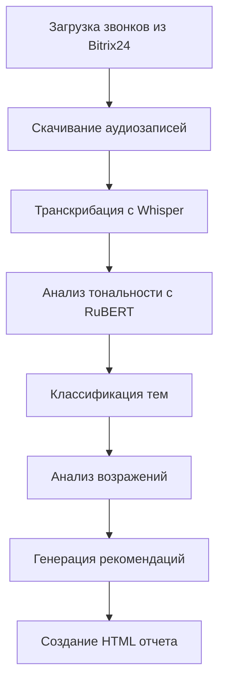

# 🤖 Bitrix24 Local AI Analytics with Smart Objections Analysis

**Полностью локальная система анализа звонков с ИИ** - никаких внешних API!

## ✨ Новые возможности v2.0

### 🚫 Интеллектуальный анализ возражений клиентов
- **🎯 Автоматическое выявление** 10 основных типов возражений
- **💡 Практические рекомендации** для каждого типа возражения
- **🔮 Создание новых категорий** для неизвестных возражений
- **😊 Анализ тональности** с помощью RuBERT модели
- **📊 Детальная статистика** по возражениям и эффективности их обработки

### 🎯 Стандартные категории возражений:

| Возражение | Рекомендация |
|------------|-------------|
| 🎯 **Высокая цена** | Снизить цену или показать выгоду |
| ⏰ **Нет сейчас времени** | Перенести встречу или ускорить процесс |
| 🔄 **Уже есть другой вариант** | Показать преимущества перед текущим решением |
| 🔍 **Непонятна потребность** | Выявить скрытую потребность |
| 🤝 **Не может принять решение** | Помочь с принятием решения |
| ⚙️ **Не подходят условия** | Адаптировать условия под клиента |
| 🛡️ **Не хватает доверия и репутации** | Предоставить гарантии и референсы |
| ⭐ **Сравнивает с конкурентами** | Выделить уникальные преимущества |
| 🔧 **Недостаточное качество или функциональность** | Доработать продукт под требования клиента |
| 🎓 **Не уверен в опыте и компетенциях** | Показать экспертизу в отрасли |

## 🤖 Используемые модели ИИ

| Компонент | Модель | Назначение |
|-----------|--------|------------|
| 🎤 **Транскрибация** | **Whisper (medium)** | Преобразование аудио в текст |
| 😊 **Анализ тональности** | **sismetanin/rubert-ru-sentiment-rureviews** | Определение настроения и эмоций клиента |
| 🏷️ **Классификация тем** | **BART + Zero-shot** | Определение темы разговора |
| 🚫 **Анализ возражений** | **RuBERT + эвристические алгоритмы** | Выявление и классификация возражений |

## ✨ Основные особенности

- 🎤 **Локальная транскрибация** с OpenAI Whisper
- 🧠 **Локальный ИИ анализ** с трансформерами  
- 🔒 **Полная конфиденциальность** - данные не покидают ваш сервер
- 💰 **Без внешних API** - нет расходов на OpenAI/Google
- 🚀 **Высокая скорость** обработки на GPU
- 💾 **Умное кеширование** всех этапов
- 🚫 **Интеллектуальный анализ возражений** с практическими рекомендациями
- 🔮 **Автоматическое создание** новых категорий возражений

## 📋 Системные требования

### Минимальные требования
- **CPU**: 4+ ядер
- **RAM**: 8GB+ 
- **Диск**: 8GB свободного места
- **Python**: 3.8+

### Рекомендуемые требования  
- **GPU**: NVIDIA с поддержкой CUDA (RTX 3060+)
- **RAM**: 16GB+
- **Диск**: 15GB+ (SSD предпочтительно)

## 🚀 Установка

### 1. Клонирование и настройка окружения

```bash
# Создаем виртуальное окружение
python -m venv venv

# Активируем (Linux/Mac)
source venv/bin/activate
# Или для Windows
venv\Scripts\activate
```

### 2. Установка зависимостей

```bash
# Основные зависимости
pip install -r requirements.txt

# Для GPU ускорения (CUDA 11.8)
pip install torch torchvision torchaudio --index-url https://download.pytorch.org/whl/cu118

# Или для CUDA 12.1
pip install torch torchvision torchaudio --index-url https://download.pytorch.org/whl/cu121

# Или CPU версия (медленнее)
pip install torch torchvision torchaudio --index-url https://download.pytorch.org/whl/cpu
```

### 3. Дополнительные системные пакеты

**Ubuntu/Debian:**
```bash
sudo apt-get update
sudo apt-get install ffmpeg portaudio19-dev
```

**macOS:**
```bash
brew install ffmpeg portaudio
```

**Windows:**
- Скачайте FFmpeg с [официального сайта](https://ffmpeg.org/download.html)
- Добавьте в PATH

## ⚙️ Настройка

### Переменные окружения

Создайте файл `.env`:

```env
# Обязательные настройки Bitrix24
BITRIX_WEBHOOK_URL=https://your-domain.bitrix24.ru/rest/1/your-webhook-code
BITRIX_USERNAME=your-username
BITRIX_PASSWORD=your-password

# Локальные модели загружаются автоматически
# Дополнительных API ключей НЕ требуется!
```

### Получение Webhook Bitrix24

1. **Войдите в Bitrix24** → **Приложения** → **Разработчикам**
2. **Другое** → **Входящий вебхук**
3. **Создайте webhook** с правами:
   - ✅ `voximplant` - для получения звонков
   - ✅ `crm` - для активностей и файлов  
   - ✅ `user` - для имен сотрудников
4. **Скопируйте URL webhook**

## 🎯 Запуск

```bash
streamlit run main.py
```

**Откроется веб-интерфейс:** `http://localhost:8501`

### Первый запуск

При первом запуске система автоматически:
1. 📥 Скачает модели ИИ (~3-4GB)
2. 🤖 Загрузит их в память
3. ✅ Будет готова к работе

*Это займет 5-15 минут в зависимости от интернета*

## 🔧 Использование

### Веб-интерфейс

1. **Настройте подключение** к Bitrix24 в боковой панели
2. **Выберите период** анализа (день или диапазон)  
3. **Запустите обработку** кнопкой "Загрузить и проанализировать"
4. **Анализируйте возражения** в специальном разделе
5. **Экспортируйте отчет** по возражениям

### Что происходит при обработке



## 📊 Возможности анализа

### Автоматическое определение:

- **🎯 Темы звонков:**
  - Продажи и коммерческие предложения
  - Техническая поддержка  
  - Консультации по продукту
  - Жалобы и претензии
  - Информационные запросы
  - Заказы и оформление услуг
  - Партнерство и сотрудничество

- **😊 Тональность разговора:**
  - Позитивная (клиент доволен) 😊
  - Негативная (клиент недоволен) 😞
  - Нейтральная (стандартный разговор) 😐

- **🚫 Возражения клиентов:**
  - 10 основных категорий возражений
  - Автоматические рекомендации по обработке
  - Создание новых категорий для неизвестных возражений
  - Анализ тональности при возражениях

## 📈 Новая структура отчетов

### HTML отчет включает:

- 📊 **Общую статистику** (всего/входящие/исходящие звонки)
- 👥 **Эффективность менеджеров** с метриками
- 🎯 **Анализ тем звонков** с процентным распределением  
- 😊 **Тональность разговоров** с визуализацией
- 🚫 **Детальный анализ возражений** с рекомендациями
- 💡 **Статистика по типам возражений**
- 📋 **Детальную таблицу** всех звонков с анализом
- 📝 **Примеры транскрипций** с разметкой возражений

### Интерактивные элементы:

- 📊 Графики и диаграммы возражений
- 🔍 Фильтрация по типам возражений
- 📱 Адаптивный дизайн  
- 💾 Экспорт данных и отчетов
- 🔮 Управление пользовательскими категориями

## 📂 Организация данных

```
bitrix_analytics/
├── audio/                    # Аудиозаписи по датам
│   ├── 2024-01-15/
│   │   ├── 2024-01-15_09-30-15_incoming_Ivan_Petrov_79001234567_id123.mp3
│   │   └── ...
│   └── 2024-01-16/
├── transcripts/              # Транскрибации Whisper
│   ├── 2024-01-15/
│   │   ├── transcript_123.txt
│   │   └── ...
├── analysis/                 # ИИ анализ звонков
│   ├── 2024-01-15/
│   │   ├── analysis_123.json
│   │   └── ...
├── cache/                   # Кеш API данных
│   ├── calls_2024-01-15.json
│   └── ...
├── reports/                # Готовые отчеты
│   ├── local_ai_report_20240115.html
│   ├── objections_report_20240115.json
│   └── ...
├── custom_objections.json   # НОВОЕ: Пользовательские категории возражений
└── custom_objections_export_*.json  # Экспорт пользовательских категорий
```

## ⚡ Оптимизация производительности

### Для ускорения обработки:

1. **Используйте GPU:**
   ```python
   # Проверьте доступность CUDA
   import torch
   print(f"CUDA доступна: {torch.cuda.is_available()}")
   print(f"Устройств GPU: {torch.cuda.device_count()}")
   ```

2. **Оптимальный размер батча:**
   - GPU 8GB+: обрабатывает 5-10 файлов одновременно
   - GPU 4-8GB: по 2-5 файлов
   - CPU: по 1 файлу

3. **Модели:**
   - Whisper `medium` - рекомендуемая для точности
   - RuBERT автоматически оптимизируется под устройство

### Время обработки (примерно):

| Количество звонков | CPU (8 ядер) | GPU (RTX 3070) | GPU (RTX 4080) |
|-------------------|--------------|----------------|----------------|
| 10 звонков (30 мин аудио) | ~30 минут | ~10 минут | ~7 минут |
| 50 звонков (2.5 ч аудио) | ~2.5 часа | ~45 минут | ~30 минут |
| 100 звонков (5 ч аудио) | ~5 часов | ~1.5 часа | ~1 час |

## 🔧 Устранение неполадок

### Проблемы с моделями

**Ошибка загрузки RuBERT:**
```bash
# Очистите кеш transformers
rm -rf ~/.cache/huggingface/
# Переустановите с принудительным обновлением
pip install --upgrade --force-reinstall transformers
```

**Проблемы с тональностью:**
```python
# Проверьте загрузку модели sentiment
from transformers import AutoTokenizer, AutoModelForSequenceClassification
tokenizer = AutoTokenizer.from_pretrained("sismetanin/rubert-ru-sentiment-rureviews")
model = AutoModelForSequenceClassification.from_pretrained("sismetanin/rubert-ru-sentiment-rureviews")
```

### Проблемы с памятью

**"CUDA out of memory" при анализе возражений:**
- Уменьшите размер модели Whisper до `base`
- Обрабатывайте меньше файлов одновременно
- Используйте CPU версию для sentiment анализа

## 🚫 Управление категориями возражений

### Просмотр всех категорий:
```python
from ai_analyzer import LocalAIAnalyzer
analyzer = LocalAIAnalyzer()
categories = analyzer.get_all_objection_categories()
print(categories)
```

### Экспорт пользовательских категорий:
```python
from data_manager import DataManager
manager = DataManager(Path("bitrix_analytics"))
export_path = manager.export_custom_objections()
```

### Импорт категорий:
```python
success = manager.import_custom_objections("path/to/export.json")
```

## 🆚 Сравнение с облачными решениями

| Параметр | Локальная система | Облачные API |
|----------|------------------|-------------|
| **Конфиденциальность** | ✅ Максимальная | ❌ Данные в облаке |
| **Стоимость** | ✅ Только электричество | ❌ Плата за токены |
| **Скорость** | ✅ Без задержек сети | ❌ Зависит от интернета |
| **Качество анализа возражений** | ✅ Специализированная RuBERT | ❌ Общие модели |
| **Персонализация** | ✅ Создание своих категорий | ❌ Фиксированные категории |
| **Масштабируемость** | ⚠️ Ограничена железом | ✅ Неограниченная |

## 📞 Поддержка и обновления

### Новое в версии 2.0:
- ✅ Интеллектуальный анализ возражений
- ✅ Модель sismetanin/rubert-ru-sentiment-rureviews
- ✅ Автоматическое создание новых категорий
- ✅ Практические рекомендации
- ✅ Экспорт/импорт пользовательских категорий
- ✅ Улучшенный интерфейс с анализом тональности

При возникновении проблем:

1. **Проверьте логи** в консоли Streamlit
2. **Убедитесь в наличии GPU** драйверов и CUDA для RuBERT
3. **Проверьте настройки** Bitrix24 webhook  
4. **Освободите место** на диске для новых моделей (дополнительно ~1GB)
5. **Перезапустите приложение** при сбоях моделей

## 📝 Лицензия

MIT License - свободное использование и модификация.

---

**🎯 Готово к работе!** 

Запустите `streamlit run main.py` и начните анализировать возражения ваших клиентов с помощью локального ИИ!

### 🔮 Следующие обновления:
- Интеграция с CRM системами
- Анализ эмоций в голосе
- Предиктивная аналитика по возражениям
- Автоматическое обучение моделей на ваших данных